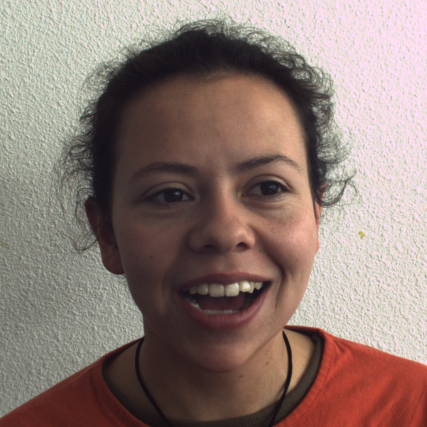
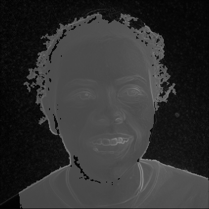
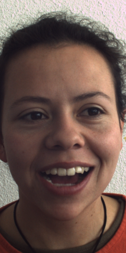
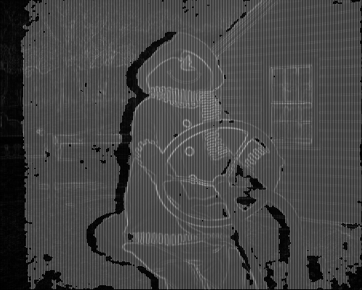

# Seam Carving
Implementation of Seam Carving for Content-Aware Image Resizing for final project of computer vision course of IUT.

## Introduction
The goal of this project is to perform content-aware image resizing for reduction with seam carving operator. This allows image to be resized without losing or distorting meaningful content from scaling.

## Algorithm Overview
### Seam Removal
1. Calculate energy map: 
>Energy is calculated by sum the absolute value of  gradient map, saliency map and depth map using ideas from [this article](https://sci-hub.se/https:/ieeexplore.ieee.org/abstract/document/7025230). Energy map is a 2D image with the same dimension as input image.

2. Build accumulated cost matrix using forward energy: 
>This step is implemented with dynamic programming. The value of each pixel is equal to its corresponding value in the energy map added to the minimum new neighbor energy introduced by removing one of its three top neighbors (top-left, top-center, and top-right)

3. Find and remove minimum seam from top to bottom edge: 
>Backtracking from the bottom to the top edge of the accumulated cost matrix to find the minimum seam. All the pixels in each row after the pixel to be removed are shifted over one column to the left if it has index greater than the minimum seam.

4. Repeat step 1 - 3 until achieving targeting width 

## Result of the Diana

| Original image         | energy map        |  scaling down         |
| ---------------------- | ---------------------- | ---------------------- |
|  |  |  |

## Result of the Snowman
| Original image         | energy map        |  scaling down         |
| ---------------------- | ---------------------- | ----------------------- |
|  |  |  |
